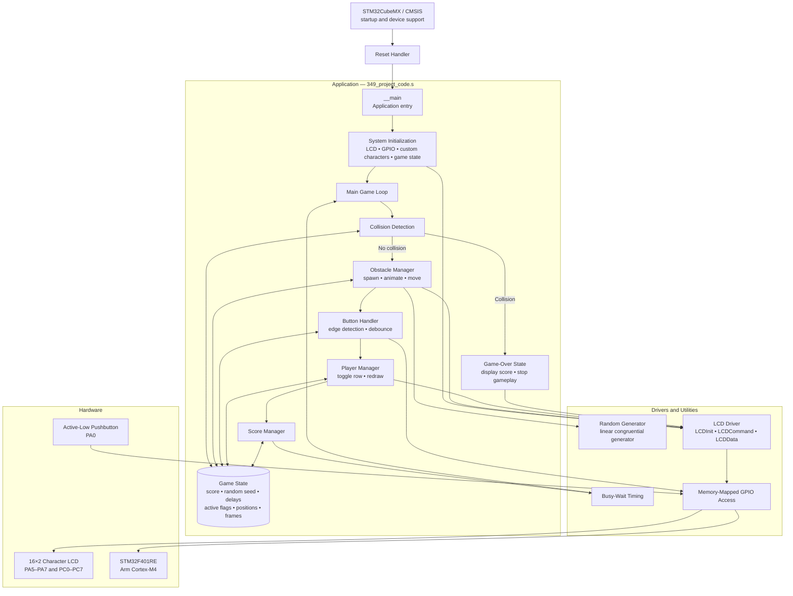

# Project Overview

 This is an embedded obstacle dodging game for the STM32F401RE Arm Cortex-M4 microcontroller. The goal of the game is for the player to last as long as possible while dodging objects that are flying towards them. The player moves between the top and bottom rows of the LCD by pressing a pushbutton as the obstacles move in a random order from left to right. 

**Watch the video demo below**

 # Hardware

| Component | STM32 Connection |
|-----------|------------------|
|LCD data bus| PC0-PC7, 8-bit parallel|
|LCD RS | PA5|
|LCD RW | PA6|
|LCD Enable | PA7|
|Pushbutton| PA0, active-low|
|Target| STM32F401RETx, Cortex-M4|
Clock| Default 16 MHz HSI|

# Software Architecture

# How The Game Works
1. Check whether the player and an active obstacle collide at column 15.
2. Decrement the top and bottom obstacle spawn timers.
3. Draw or move active obstacles.
4. Read PA0 and toggle the player’s row on a new button press.
5. Advance each obstacle’s animation frame and position.
6. Clear and redraw the player.
7. Increment the score.
8. Wait using a busy-loop delay and repeat.

When a collision occurs, the program clears the LCD and prints "GAME OVER!" along with a three-character score.

